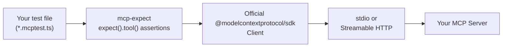

# mcp-expect

[](https://github.com/fba5147/mcp-expect/actions/workflows/ci.yml)
[](https://www.npmjs.com/package/mcp-expect)
[](https://www.npmjs.com/package/mcp-expect)
[](./LICENSE)
[](https://www.typescriptlang.org/)

Jest-style assertions for testing MCP (Model Context Protocol) servers.




```ts
defineTest("search tool", { command: "node", args: ["server.js"] }, async ({ expect }) => {
  await expect.tool("search").exists();

  await expect.tool("search")
    .withInput({ query: "hello" })
    .respondsWithin(2000);

  await expect.tool("search")
    .withInput({ query: 123 })       // wrong type
    .rejectsInvalidInput();

  await expect.tool("search")
    .withInput({ query: "hello" })
    .returnsSchema({ results: "array" });
});
```

Run it, get a real pass/fail report — no writing raw `client.callTool()` calls, no guessing why an AI coding assistant thinks your working server is broken.

## Why

MCP servers fail in a small number of very specific ways: a tool isn't actually
registered, a handler hangs, a schema silently accepts bad input, or a result
doesn't look like what the caller expects. Those are exactly the four
assertions below. This is deliberately not a general test framework — it's a
thin, opinionated layer on the official `@modelcontextprotocol/sdk` client
aimed at catching those four failure modes in CI, before an agent has to
discover them at runtime.

## Runs in CI out of the box

```
npx mcp-expect "dist/**/*.mcptest.js"   →   fails the build on any red assertion   →   annotates the exact line on the PR diff
```

```yaml
- run: npx mcp-expect "dist/**/*.mcptest.js"
```

A non-zero exit code on failure means it works in any CI system with zero
configuration. When `GITHUB_ACTIONS=true` is set (which GitHub does
automatically), failures are also emitted as `::error file=...::`
annotations, so they show up inline on the PR diff — not just buried in a
log.

## Install

```bash
npm install --save-dev mcp-expect zod
```

## Quickstart

1. Write a test file ending in `.mcptest.ts` (compile it, or run via `tsx`/`ts-node`):

```ts
// search.mcptest.ts
import { defineTest } from "mcp-expect";

const server = { command: "node", args: ["./dist/server.js"] };

defineTest("search tool is registered", server, async ({ expect }) => {
  await expect.tool("search").exists();
});
```

2. Run it:

```bash
npx mcp-expect "dist/**/*.mcptest.js"
```

You'll get colored pass/fail output and a non-zero exit code on failure, so it
drops straight into CI.

## Server configs

Two transports are supported out of the box:

```ts
// stdio — the server is a local process
{ command: "node", args: ["server.js"], env: { API_KEY: "..." } }

// Streamable HTTP — the server is already running somewhere
{ url: "http://localhost:3000/mcp", headers: { Authorization: "Bearer ..." } }
```

A fresh connection is made per `defineTest` and closed afterward, so tests
don't leak state into one another. If you have several tests against the
same server, `describeServer()` groups them under **one shared connection**
instead — see [Performance characteristics](#performance-characteristics).

```ts
import { describeServer } from "mcp-expect";

describeServer({ command: "node", args: ["server.js"] }, (defineTest) => {
  defineTest("search exists", async ({ expect }) => {
    await expect.tool("search").exists();
  });

  defineTest("search responds", async ({ expect }) => {
    await expect.tool("search").withInput({ query: "hi" }).respondsWithin(1000);
  });
});
```

The `defineTest` you get, whether top-level or scoped inside
`describeServer`, supports `.only(...)` (run just this test, skipping every
other test in the whole invocation) and `.skip(...)` (never run it), for
focusing during debugging.

## API reference

### `expect.tool(name)`

Returns a `ToolAssertion` for the given tool name, bound to the client for the
current test.

### `.withInput(args)`

Sets the arguments used by the assertions below it. Returns `this`, so it
chains.

### `.exists()`

Asserts the tool is registered and discoverable via `tools/list`.

### `.respondsWithin(ms)`

Asserts a call with the current input completes within `ms` and does not
return `isError: true`. This is the single most useful assertion in practice —
a hanging handler is the most common reason an AI coding assistant decides
your working MCP server is broken and starts "fixing" it.

### `.rejectsInvalidInput()`

Asserts the current input is rejected, either by a protocol-level schema
error or by an `isError: true` result. If the call silently succeeds, the
assertion fails — that's a sign your input schema is too loose.

### `.returnsSchema(shape)`

Asserts the result matches a **shallow** shape, e.g.
`{ results: "array", count: "number" }`. Intentionally not full JSON Schema
validation — a quick shape check, not a validator. See `.matchesOutputSchema()`
below for the real thing.

### `.matchesOutputSchema()`

Asserts the result validates against the tool's **own declared `outputSchema`**
(from `tools/list`), using [`ajv`](https://www.npmjs.com/package/ajv) — full
JSON Schema validation, no shape spec to write yourself. Throws a clear error
if the tool doesn't declare an `outputSchema` at all; use `.returnsSchema()`
for those.

### `.isSafeAgainst(field, categories)`

Fuzzes the given input field with known malicious payloads —
`"path-traversal"` and/or `"command-injection"` — and asserts every one is
rejected (`isError: true`, or a thrown error). Any payload that gets through
is a real finding: the failure message includes exactly which payload
succeeded and what the server returned. This is a narrow smoke test for the
single most common class of real-world MCP tool bug (an argument passed
unchecked into a filesystem or shell call), not a general security scanner.

```ts
await expect.tool("read_file").withInput({ path: "safe.txt" }).isSafeAgainst("path", "path-traversal");
```

## Working example

See [`example/`](./example) for a complete demo: a small MCP server exposing
a `search` tool, and a test file exercising all four assertions.

```bash
npm install
npm run test:example
```

Want to see what a failing assertion looks like? `example/red-demo.mcptest.ts`
is the same server with one deliberately-wrong expectation, kept in its own
file so it doesn't turn the main demo (or CI) red:

```bash
npm run demo:fail
```

Not convinced a testing library that only tests its own demo server proves
anything? It's also run against two of the official MCP reference servers,
maintained independently of this project — deliberately different from each
other and from the demo server, to shake out transport and schema quirks:

- [`@modelcontextprotocol/server-everything`](https://www.npmjs.com/package/@modelcontextprotocol/server-everything)
  (`example/real-server.mcptest.ts`) — a stdio server with no startup
  arguments, returning `structuredContent` shaped as a flat object.
- [`@modelcontextprotocol/server-filesystem`](https://www.npmjs.com/package/@modelcontextprotocol/server-filesystem)
  (`example/filesystem-server.mcptest.ts`) — takes a startup argument (the
  allowed directory), rejects invalid input two different ways (bad argument
  type *and* a path outside the sandbox, both surfaced as `isError: true`
  rather than a thrown error), and nests its result under a `content` string
  instead of an object.

Both of those use `describeServer()` to share one connection across all their
assertions.

```bash
npm run test:everything-server
npm run test:filesystem-server
```

Want proof `.isSafeAgainst()` actually catches a real bug, not just passes
against servers that are already safe? `example/vulnerable-demo-server.ts` is
a deliberately naive tool (interpolates unchecked input into a shell command)
and `example/security-red-demo.mcptest.ts` shows the assertion catching it —
including the leaked `whoami` output proving the command actually ran:

```bash
npm run demo:security-fail
```

## Performance characteristics

A plain `defineTest` opens a fresh connection before running its assertion,
so per-test wall time is dominated by process startup, not the assertion
logic itself:

- Local stdio server (already-installed binary): ~300-370ms per test
- Server launched via `npx` (like the reference servers above): ~700-820ms
  per test, mostly `npx`'s own resolution overhead, not this library

`describeServer()` avoids paying that cost per test by sharing one
connection across a group. Measured on the real reference-server suites in
`example/`: the first test in a group still pays the ~800ms connection cost,
but every subsequent test in the same group runs in **2-57ms** — a 5-test
suite that would've taken ~4s sequentially now takes about 1s total.

Test execution is still **sequential** — independent connections (or
groups) run one after another, not concurrently. Parallelizing across them
is a reasonable future improvement; it isn't built yet, so this README
doesn't claim it.

Runtime dependencies are `@modelcontextprotocol/sdk` (the client you're
already relying on to talk to the server), [`ajv`](https://www.npmjs.com/package/ajv)
for `.matchesOutputSchema()`, [`chalk`](https://www.npmjs.com/package/chalk)
for colored output, and [`fast-glob`](https://www.npmjs.com/package/fast-glob)
for test file discovery — not zero, but small and deliberate.

Code coverage (via [`c8`](https://www.npmjs.com/package/c8)) is wired up
with `npm run coverage`, currently around 66% of statements in `src/`. It
isn't tracked in CI or published as a badge yet — there's no history to
compare against, so a single snapshot number would be more decorative than
useful.

## Releasing

Publishing to npm is automated via [`.github/workflows/publish.yml`](.github/workflows/publish.yml)
using npm's OIDC trusted publishing — no long-lived npm token is stored in
the repo. To cut a release:

```bash
npm version patch   # or minor / major — updates package.json and creates a git tag
git push --follow-tags
```

The workflow verifies the pushed tag matches `package.json`'s version, runs
the full test suite (local demo + both real-server suites), and then
publishes. If any of that fails, nothing gets published.

## What this is not (v1 scope)

- Not a multi-model grading harness — it doesn't judge how well an LLM
  interprets your tool descriptions.
- Not a general fuzzer — `.isSafeAgainst()` checks a small, curated set of
  known path-traversal and command-injection payloads, not arbitrary input
  generation.
- Not a registry or discovery tool.

These may show up in later versions once the core assertion set has proven
useful in practice. Contributions and issues welcome.

If `mcp-expect` proves useful, the plan is a small family of focused MCP
developer tools rather than one monolithic framework — published under the
[`@mcp-expect`](https://www.npmjs.com/org/mcp-expect) npm org as they're
built. Nothing beyond this package exists yet.

## License

MIT
